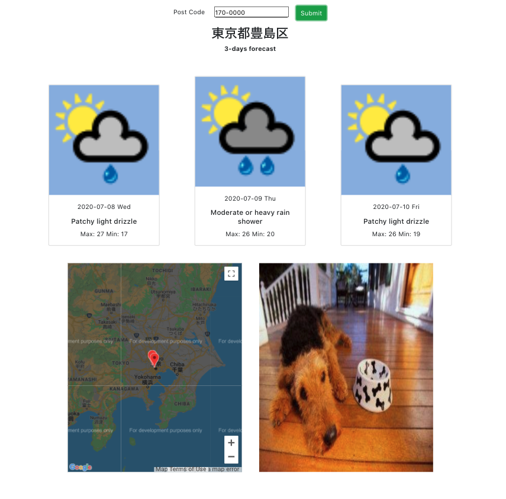

# Intro ?

🌤 An weather dashboard based on the post-code input.
📍 It will show 3 days weather and mark the location on the map.
🐶 It will also show you a lovely dog to make your day.

  

# How to use it ?

\$git clone https://github.com/Zowie0122/corekara-weather-app.git

\create a file under component called config.json, apply a key from
https://apis.postcode-jp.com/api(key1)
http://api.worldweatheronline.com (key2)

and paste below in your config.json
{
"POST_CODE_KEY": "your key1",
"WEATHER_KEY": "your key2"
}

\$yarn

\$yarn start
